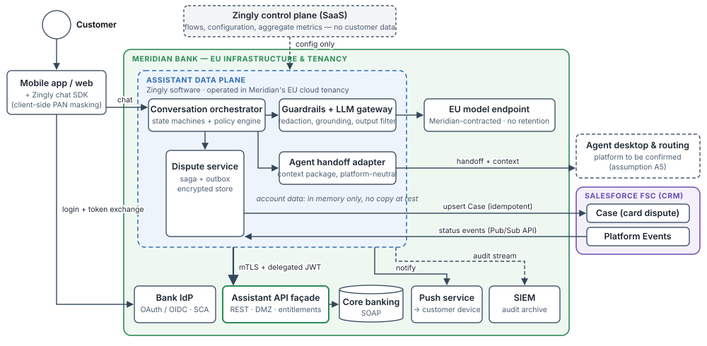
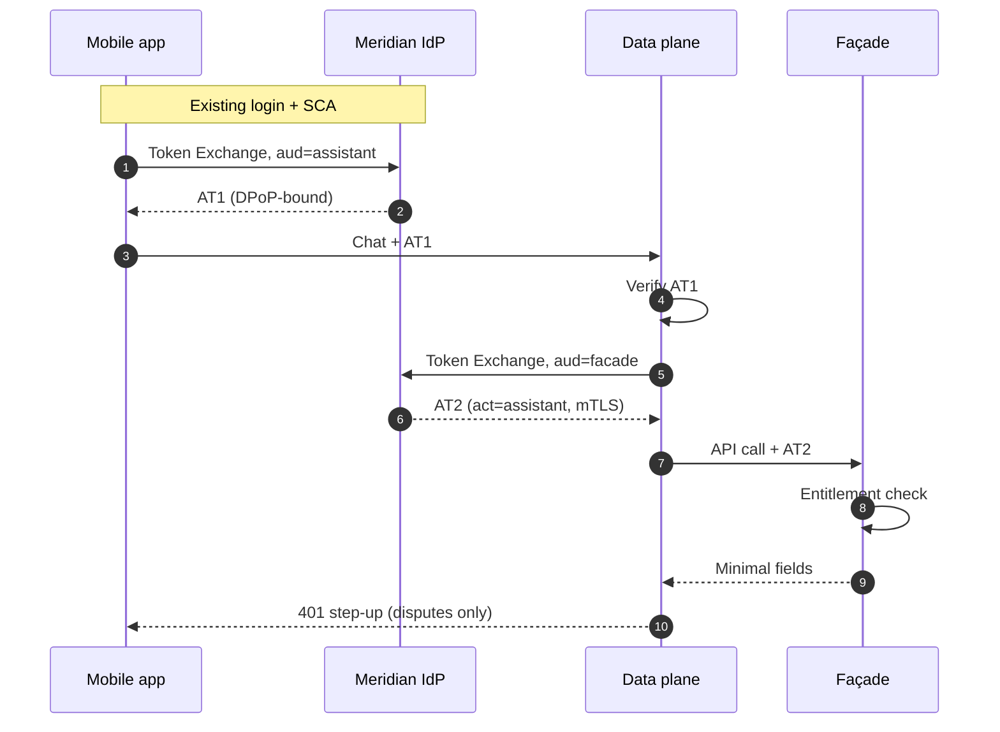
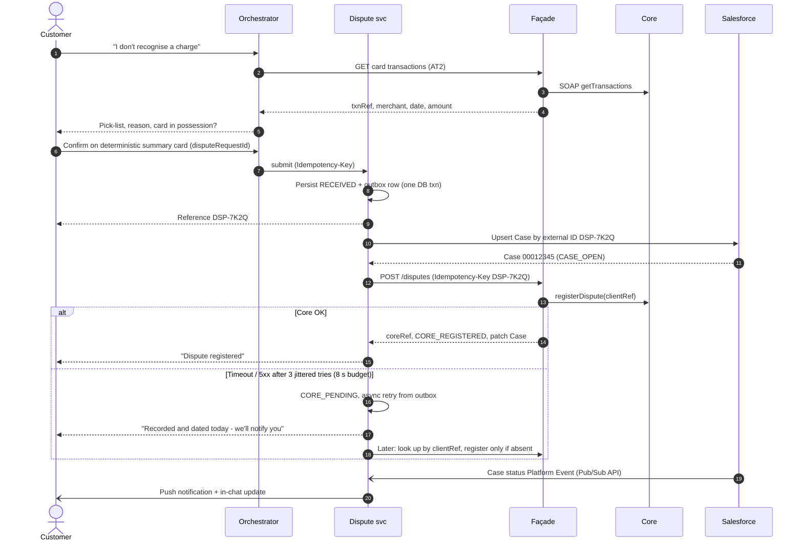

# Meridian Bank — Digital AI Assistant
## Solution Architecture · v0.9 (draft for architecture review)

**Prepared for:** Meridian Bank — Enterprise Architecture, Information Security, Digital Channels · **Prepared by:** Zingly Solutions Architecture (E. Richardson) · **Date:** 30 Sep 2026

### 1. Executive summary

Meridian wants a digital assistant in its mobile app and website that answers account questions, lets customers dispute card transactions, and hands over to a human agent with full context, starting with a six-week proof of concept. This document sets out the target architecture, the decisions behind it, and the delivery plan.

- **Account data stays under Meridian's control.** Zingly's data-handling components (the *data plane*) run in Meridian's EU cloud tenancy. Zingly's SaaS control plane holds configuration and aggregate metrics only. This directly addresses Meridian's requirement that a non-EU-headquartered vendor must not hold or have standing access to account data.
- **One governed route to account data.** The assistant reaches core banking only through a bank-owned **Assistant API façade**. It uses short-lived, narrowly-scoped tokens issued by Meridian's identity provider. Meridian decides which fields leave the core, and can switch the assistant off by revoking one client.
- **Disputes are never lost.** Each dispute is durably recorded and given a reference before any downstream call. Case creation in Salesforce and registration in core banking are idempotent and retried, and the date the customer notified the bank is preserved even if core banking is unavailable.
- **The AI is constrained by design.** Deterministic flows execute every regulated action. Answers are grounded in bank data and approved content. The model never sees card numbers or credentials, and never generates a monetary figure.
- **The six-week PoC is achievable.** It runs on synthetic customers in a Zingly-operated EU sandbox using the same data-plane build that will later run in Meridian's tenancy. The production pilot follows in months 3–4 (§14).

### 2. Business context & scope

Meridian (EU, ~4M retail customers) runs Salesforce Financial Services Cloud (FSC) as its CRM and a core-banking platform exposing SOAP services behind its firewall.

| In scope (initial release) | Out of scope (initial release) |
|---|---|
| Balance and recent-transaction questions; fee explanations grounded in Meridian's tariff | Payments, transfers, limit changes, or any money movement |
| Card transaction disputes: capture, case creation, status updates | Card blocking/replacement (candidate for the next release) |
| Escalation to a human agent with conversation context | Financial, investment or credit advice |
| Mobile app (iOS/Android) and website; English + one local language | Voice/IVR (the façade and token model are designed to be reused by voice) |

**Non-functional requirements:** account data processed only in the EU and under Meridian's control; complete audit trail of assistant actions; graceful degradation when bank systems are unavailable; design capacity of 1M conversations/month at a peak of 10 new conversations per second.

### 3. Assumptions

These assumptions underpin the design. Each will be validated in discovery week 1 (see open questions, §15).

| # | Assumption | Impact if not true |
|---|---|---|
| A1 | The app and website authenticate customers through a Meridian OAuth 2.0/OIDC authorization server with SCA, which supports (or can be configured for) OAuth Token Exchange. | Meridian's API gateway mints the assistant token instead. The Zingly side is unchanged. |
| A2 | Core-banking SOAP services are not internet-exposed. Meridian has an API gateway/DMZ that can host a REST façade. | The façade is hosted in the data plane instead, with bank-side network controls. |
| A3 | Meridian operates an EU container platform (private or public cloud) that can host vendor-supplied workloads. | The pilot runs in a Zingly-operated, Meridian-dedicated EU environment with Meridian-held keys (see D1 alternative). |
| A4 | The Salesforce FSC org exposes standard REST and Platform Event APIs to integrations. Card disputes are represented as Case records. | Mapping to FSC dispute objects or an existing dispute process changes the adapter, not the flow. |
| A5 | Human agents handle digital conversations on a contact-centre platform that can accept a routed conversation plus a context payload via API. **Which platform is not yet confirmed.** | Handoff sits behind a platform-neutral adapter. The adapter is rebuilt for the chosen platform; the rest of the design is unaffected. |
| A6 | Agents view customer and Case details in Salesforce FSC under their own entitlements. | The context package would need to carry more data, which requires a privacy review. |
| A7 | Meridian's app has a push-notification service the assistant can trigger via API. | Status updates are shown in-app only when the customer next opens the assistant. |
| A8 | Disputable items are posted card transactions (debit and credit). Reasons: unauthorised, not received, duplicate, incorrect amount, cancelled recurring payment. | Reason codes and eligibility rules are configuration. |
| A9 | The PoC uses synthetic/test customers only. | Using real customers in the PoC would require the DPIA and production hosting to be ready first. |

### 4. Architecture overview

**Principles:** (1) the bank's systems remain systems of record, and the assistant holds only transient working state; (2) least data, from the source, for the shortest time; (3) deterministic control of regulated actions, with the LLM used for language only; (4) everything that touches customer data is one deployable unit (the data plane) that runs in Meridian's tenancy.

| Component | Operated by | Responsibility |
|---|---|---|
| Chat SDK | Meridian app | Chat UI, token acquisition, client-side masking of card-number-like input |
| Conversation orchestrator | Data plane | Conversation state machines, policy engine (which tool, which scope), rendering |
| Guardrails + LLM gateway | Data plane | Redaction, grounding, prompt assembly, output validation, model routing |
| Dispute service | Data plane | Dispute saga, outbox, idempotency store, status-event consumer |
| Agent handoff adapter | Data plane | Builds the context package; integrates with the agent platform (A5) |
| Assistant API façade | Meridian | Only route to core; entitlement checks; field allow-list; caching; rate limits |
| Zingly control plane | Zingly SaaS | Flow design, configuration, releases, aggregate analytics — no customer data |

### 5. Identity & access

The customer is already authenticated in the app. We propagate that identity with **OAuth 2.0 Token Exchange (RFC 8693)** rather than a second login. The app exchanges its token for a *Zingly-audience* token. The data plane then exchanges that for a *façade-audience* token that records the assistant as the acting party (`act` claim).

| Token | Audience | Lifetime | Key claims / binding | Scopes |
|---|---|---|---|---|
| AT1 (customer → assistant) | `meridian-assistant` | 10 min, silently re-exchanged | `sub` = **pairwise** pseudonym (the assistant never learns the customer number), `acr`, `auth_time`, `sid`, `cnf.jkt` (DPoP, RFC 9449) | `assistant.accounts.read`, `assistant.transactions.read`, `assistant.disputes.write`, `assistant.handoff` |
| AT2 (assistant → façade) | `meridian-assistant-facade` | 5 min | `act.sub = assistant-dataplane`, `cnf.x5t#S256` (mTLS-bound, RFC 8705) | Only what the current step needs |

**Flow notes:** (1) the subject token is the app's access token, with a DPoP proof attached. (4) The data plane verifies the signature against Meridian's JWKS, plus `iss`, `aud`, `exp`, scope and DPoP key binding. (5) The data plane authenticates with `private_key_jwt` (RFC 7523). (8) The façade maps the pairwise ID to the customer and checks ownership. (10) Submitting a dispute requires `acr`=high and a recent `auth_time`. Otherwise the assistant returns `insufficient_user_authentication` (RFC 9470) and the app runs biometric step-up.

**Authorization is layered.** Scope checks in the policy engine fail fast. **Ownership and entitlement checks at the façade are authoritative**: a compromised assistant still cannot read another customer's data. Salesforce sharing rules govern agents. **Session end:** OIDC Back-Channel Logout on `sid` terminates the conversation and drops in-memory state. **Web:** the same pattern runs through Meridian's web back-end-for-frontend.

### 6. Data access & residency

**Façade API (REST/JSON, OpenAPI v1):** `GET /accounts`, `GET /accounts/{acctRef}/balance`, `GET /cards/{cardRef}/transactions`, `GET /transactions/{txnRef}` (including fee code), `POST /disputes`, `GET /disputes/{disputeId}`. Responses carry **opaque references**, never a full IBAN or card number. Cards are displayed as `•• 4821`.

| Data class | Assistant / LLM access | Stored where, how long |
|---|---|---|
| Credentials, OTP, PIN, CVV | **Never.** No API returns them, and the SDK blocks them at input | Nowhere |
| Full card number (PAN) | **Never.** The SDK detects PAN-like input (digit pattern + Luhn check) and masks it before sending; a server-side detector is the backstop | Nowhere |
| Customer number, full IBAN, national ID | No — pairwise `sub` and opaque refs only | Meridian systems only |
| Balances, transaction amounts | Orchestrator: in memory for one turn. **LLM: placeholders only** (§10) | Not persisted |
| Merchant, date, category, fee code | Yes (needed for disambiguation and fee explanation) | In memory per turn |
| Dispute working record | Yes | Encrypted dispute store; purged 30 days after core registration |
| Transcripts | Yes | Meridian archive (system of record, Meridian retention policy); redacted operational copy in data plane for 30 days |
| Audit events | — | Streamed to Meridian SIEM in near-real time |

**Residency.** All processing takes place in the EU, in Meridian's tenancy. The model endpoint runs in an EU region under Meridian's contract, with no training on and no retention of inputs. Zingly support staff have no standing access; break-glass access is approved by Meridian, time-boxed and logged. There is **no failover outside the EU**: for this service, residency takes precedence over availability.

### 7. Dispute flow

**Order of operations:** record → Salesforce case → core registration. For unauthorised transactions, PSD2 (Art. 71 and 73) ties Meridian's obligations to when the customer notifies the bank. Recording the dispute and opening the case before touching core banking means a core outage can delay *registration* but never *notification*. **States:** `RECEIVED → CASE_OPEN → CORE_REGISTERED → IN_REVIEW → RESOLVED`. There are two further states: `CORE_PENDING` while retrying, and `MANUAL_REVIEW` once retries have been exhausted for 24 h. `MANUAL_REVIEW` routes the case to the disputes back-office queue and raises an alert.

**Idempotency at five layers**, because a timeout does not mean a write failed:

1. **Client:** `disputeRequestId` is generated once per confirmation, so double-taps and reconnects reuse it.
2. **Dispute service:** an idempotency store maps key → request hash → response. The same key with a different body returns `422`.
3. **Salesforce:** upsert on an external-ID field (`Dispute_Ref__c`) can only ever create one case.
4. **Core:** the façade passes `DSP-7K2Q` as the client reference and **reads before retrying**.
5. **Business rule:** one open dispute per `txnRef`. A repeat request, even from a new session, returns the existing dispute. Async retries use a client-credentials token scoped to `facade.disputes.continue`, accepted only with the confirmed instruction's evidence, because the customer's token has expired by then.

**Status updates:** the dispute service subscribes to Case status Platform Events (or Change Data Capture) through the **Pub/Sub API**. It de-duplicates on event ID and discards out-of-order updates. It notifies the customer through Meridian's push service (A7), and the app fetches current status (`GET /disputes/{id}`) when the assistant opens. **If core is down before the dispute starts**, the assistant switches to manual capture (date, amount, merchant) and opens a case flagged *transaction unverified* for an agent to match.

### 8. Agent escalation with context

**Triggers:** customer request; unsupported intent; repeated low-confidence or guardrail-blocked turns; dispute exceptions (suspected fraud, card still in use); vulnerability or complaint signals; failed step-up authentication.

**Context package** (sent by the handoff adapter to the agent platform, A5): an AI-generated summary labelled as such; intent and collected details (e.g., the draft dispute); actions taken with dispute and Case references; authentication level at handoff; escalation reason; language; redacted transcript. **Not included:** raw account data or tokens. Agents see account and Case details in Salesforce under their own entitlements (A6), so the bank's existing access model continues to govern what agents see.

**Behaviour:** warm handoff in the same chat window, with queue position shown. Out of hours or when the queue is full, the assistant offers a callback and opens a Case, so no conversation dead-ends.

### 9. Integration design

| Interface | Protocol | Authentication | Notes |
|---|---|---|---|
| App ↔ data plane | HTTPS + WebSocket | DPoP-bound AT1 | Client message IDs for de-duplication |
| Data plane → façade | REST/JSON over private connectivity | mTLS + AT2; `private_key_jwt` | Rate-limited per client; façade caches reads for ≤30 s |
| Dispute service → Salesforce | REST (upsert by external ID) | OAuth 2.0 JWT bearer; least-privilege integration user | Honours `Retry-After` |
| Salesforce → dispute service | Pub/Sub API (gRPC) | OAuth | Replay ID persisted (72 h event retention); de-dup on event ID |
| Handoff adapter → agent platform | Platform API (A5) | Per platform, service credential | Context package as described in §8 |
| Data plane → push service / SIEM | REST / syslog over TLS | mTLS | Template ID + pairwise `sub` only; at-least-once delivery |

**Errors:** RFC 9457 problem details, with a server-set `retryable` flag. **Retries:** reads use a 1.5 s timeout and 1 retry. Writes use a 5 s timeout and up to 3 attempts with exponential backoff and full jitter, inside an 8 s budget visible to the customer. After that, retries continue asynchronously, with backoff capped at 15 min, until `MANUAL_REVIEW` at 24 h. Only 408/429/5xx responses and timeouts are retried, and **only with an idempotency key**. **Circuit breaker** per downstream system: opens at a 50% failure rate over 20 calls and half-opens after 30 s. A dead-letter queue alerts on any exhausted message.

### 10. AI safety & governance

**The LLM handles language; deterministic code acts.** Disputes and escalation are explicit state machines. The LLM extracts intent and details and phrases replies. The policy engine decides which tool may run, with what parameters, under which scope. The model holds no credentials.

| Control | Implementation |
|---|---|
| Grounding | Account answers come only from the current turn's tool results. Fee and product explanations come from retrieval over Meridian-approved content (tariff, T&Cs), with the source cited. If there is no grounding, the assistant says so and offers an agent. |
| Numbers never generated | Values are passed to the model as placeholders (`{{AMT_1}}`) and substituted after generation. A validator blocks any amount or rate that cannot be traced to a tool result or the tariff. |
| Never shown to the model | PAN, CVV, PIN, OTP, passwords, customer number, full IBAN, national ID, tokens. Enforced by the façade field allow-list, gateway redaction, and automated prompt scanning in tests. |
| Prohibited statements | Advice, promises about dispute outcomes or refund timing, fee waivers, rates not in the tariff, legal interpretation. Rules plus a classifier trigger a templated reply or handoff. |
| Prompt injection | Merchant descriptors and customer text are treated as untrusted data. Tool authorization never depends on model output alone. |
| Transparency | The assistant discloses that it is an AI at the start of each conversation (EU AI Act Art. 50(1)). |
| Change control | Model and prompt versions are pinned. Every change passes a regression and red-team suite (golden conversations, injection tests, PAN-leak tests). |
| Audit (per turn → SIEM) | Timestamp, conversation ID, pairwise `sub`, token `jti`, intent, tools and parameters (references only), model and prompt version, guardrail decisions, rendered output. Append-only and hash-chained. |

### 11. Security & compliance

**Authentication & authorization:** customers authenticate via the Meridian IdP with sender-constrained tokens and step-up for disputes (§5). Services use mutual TLS and `private_key_jwt`, with keys in HSM/KMS rotated at least quarterly. Agents use Meridian SSO. **Encryption:** TLS 1.3 preferred (1.2 minimum) on every hop. Data at rest uses AES-256 with Meridian-managed keys; dispute free text also has field-level encryption. **PII handling:** data minimisation (§6), pairwise pseudonyms, redaction at client and server, automated retention purge, and data-subject access and erasure support indexed on the pairwise `sub`. No PII appears in application logs; log scrubbing is tested in CI.

The compliance positions below are design intent, to be confirmed by Meridian's DPO, compliance function and QSA:

- **GDPR:** Meridian is the controller and Zingly a processor under an Art. 28 agreement. The model provider is contracted by Meridian. A DPIA (Art. 35) is completed before the pilot. Data protection by design (Art. 25) is achieved through minimisation and pseudonymisation. Chapter V transfers are *avoided* through EU-only processing and support access, so the design does not depend on the EU-US Data Privacy Framework (upheld by the EU General Court in 2025, with an appeal pending before the CJEU). The assistant makes no dispute decisions, so Art. 22 is not engaged.
- **PCI DSS v4.0.1:** the design keeps the assistant **outside the cardholder data environment**. No PAN is stored, processed or transmitted by design, through client-side masking and masked references. The scope effect of the server-side backstop is to be confirmed with Meridian's QSA.
- **PSD2:** the assistant inherits the app's SCA and adds step-up for disputes. Dispute timestamps support the Art. 71/73 obligations for unauthorised transactions.
- **DORA (EU 2022/2554):** Zingly is an ICT third-party service provider. The contract includes the Art. 30 provisions (data locations, audit and access rights, exit strategy, incident support), and Meridian records the arrangement in its register of information.
- **EU AI Act:** the Art. 50(1) disclosure obligation applies. The system performs no creditworthiness evaluation, so we assess it as not high-risk under Annex III; Meridian legal to confirm. No biometric emotion recognition is used.

### 12. Failure modes & degraded operation

| Failure | Behaviour | Customer sees |
|---|---|---|
| Core banking down (reads) | Circuit breaker opens; façade serves cached reads (≤30 s old) | "I can't reach your account details right now," plus an offer of manual dispute capture or an agent |
| Core down mid-dispute | `CORE_PENDING`, async retry with read-before-retry; `MANUAL_REVIEW` after 24 h | Dispute reference, "recorded and dated today," and a push notification when confirmed |
| Salesforce down | Dispute held in outbox and retried | Reference still given |
| Agent platform unavailable | Callback request recorded as a Case (or in the outbox if Salesforce is also down) | "An agent will call you back" |
| Model endpoint slow/down | Fail over to a secondary EU endpoint, then **guided mode** (button-driven flows; still works because the flows are deterministic) | Buttons instead of free text |
| Meridian IdP down | Unauthenticated mode: public FAQ over Meridian content only | "Account features are temporarily unavailable" |
| Data-plane zone failure | Multi-AZ within the EU region; no out-of-region failover | Guided mode or maintenance message |
| Event stream gap | Replay from the last replay ID; beyond 72 h, reconcile via `GET /disputes` | None; pull-on-open shows current status |

### 13. Architecture decisions & alternatives considered

| # | Decision | Alternatives considered | Why we chose it (and the trade-off we accept) |
|---|---|---|---|
| D1 | **Data plane hosted in Meridian's EU tenancy**; Zingly SaaS for control plane only | Zingly-operated, Meridian-dedicated EU tenant with Meridian-held keys | Removes vendor access to account data structurally rather than contractually, which is the strongest answer to Meridian's data-sovereignty requirement. Trade-off: about 4–8 extra weeks before the pilot, and joint operations. The alternative remains the fallback if A3 does not hold. |
| D2 | **Bank-owned REST façade** for account data | Direct calls to core SOAP; replicating account data to the assistant via events | Direct access widens the firewall and couples the assistant to core schemas. Replication creates a second copy of 4M customers' financial data. The façade gives Meridian field-level control and a kill switch, and protects the core. Trade-off: Meridian builds and owns an API. |
| D3 | **Token exchange with pairwise subject** | Second OIDC login to the assistant; a session proxied via Meridian's back end; a shared API key | A second login hurts the customer experience. A shared key loses per-customer authorization. Token exchange keeps Meridian's IdP as the single authority, enables per-customer scopes, and hides the customer number. Trade-off: IdP configuration work (A1). |
| D4 | **Sender-constrained tokens** (DPoP, mTLS) | Plain bearer tokens | Stolen tokens cannot be replayed from another device or service. Trade-off: SDK and gateway support required. |
| D5 | **Record → CRM case → core**, as a saga with outbox | Synchronous core-first call; distributed transaction | Core-first loses disputes during core outages. Two-phase commit is not available across SOAP and SaaS systems. The saga preserves the notification date. Trade-off: eventual consistency, with a manual-review backstop. |
| D6 | **Platform Events + push + pull-on-open** for status | App polling; Salesforce outbound webhook | Disputes run for days, so polling wastes capacity. A webhook needs a new inbound endpoint. The Pub/Sub API is subscriber-initiated and replayable. Trade-off: 72-hour replay window, covered by reconciliation. |
| D7 | **Deterministic orchestration; LLM for language only**; numbers bound after generation | An autonomous agent choosing its own tools | Regulated actions must be predictable and auditable, and numeric hallucination is unacceptable in banking. Trade-off: new intents require flow design rather than just prompting. |
| D8 | **Meridian-contracted EU model endpoint** | Self-hosted open-weight model; Zingly-contracted endpoint | Keeps the model provider under Meridian's contract and region without GPU operations. Trade-off: provider due diligence. Self-hosting remains the fallback if no provider is approved. |
| D9 | **Platform-neutral handoff adapter**; agents use their own CRM entitlements | Building on a specific agent platform now; sending raw account data to agents | The agent platform is unconfirmed (A5). Keeping account data out of the handoff avoids creating a second access path. Trade-off: one adapter build per platform. |

### 14. Delivery plan

| Phase | Timing | Delivers | Exit criteria |
|---|---|---|---|
| Technical PoC | Weeks 1–2 | Façade OpenAPI contract agreed; token exchange against a replica IdP realm; dispute saga with fault injection plus Salesforce sandbox upsert and events; guardrail test harness (a runnable prototype of the dispute saga) | Contract signed off; idempotency proven under injected failures |
| Client PoC | Weeks 3–6 | Zingly-operated EU sandbox connected to Meridian test IdP, test façade, core test environment and Salesforce sandbox; balances, transactions, fee explanations, disputes and escalation; staff users, synthetic data | End-to-end dispute p95 < 10 s; zero PAN or credentials in prompts or logs (automated scan); security architecture review passed |
| Pilot | Months 3–4 | Data plane in Meridian's tenancy (build starts in week 4); DPIA, penetration test, DORA contract terms; step-up; monitoring; 1–5% of app users | Containment and CSAT targets met; no Sev-1 security findings |
| Scale | Months 5–9 | All customers, web and app, second language wave; new intents (card block, direct debits); voice channel reusing the façade and token model | Business KPIs and cost per conversation; operational handover |

**Meridian dependencies starting in week 1:** façade build; IdP client registration; private connectivity; Salesforce sandbox and integration user; container platform onboarding for the pilot; a named security reviewer.

### 15. Open questions for Meridian

1. **Data sovereignty:** what specifically underlies the concern about a US-headquartered vendor handling account data: data location, possible foreign legal access, vendor staff access, or use of data for model training? Are there internal policies or regulatory commitments the design must evidence?
2. **Hosting:** does Meridian have an EU container platform that can host vendor-supplied workloads, and what onboarding process applies?
3. **Identity:** which identity provider authenticates app and web customers today, and which OAuth/OIDC capabilities does it support? What re-authentication does Meridian require for servicing actions such as disputes?
4. **Core banking:** which SOAP operations exist for balances, transactions, fees and disputes? Is there an existing API gateway for exposing them, and who would own an assistant-facing API?
5. **Salesforce:** is there an integration layer we are required to use to reach Salesforce FSC, or may our services connect to it directly? How are card disputes represented and processed in FSC today?
6. **Agents:** which platform do agents use today to handle customer conversations, and how are conversations routed to them? What are the operating hours? The answer determines how handoff and context transfer are built.
7. **Dispute process:** which dispute types are in scope, who decides outcomes, what are the SLAs, and how are customers informed today?
8. **Notifications:** which channels does Meridian use to notify customers (push, in-app, email), and can the assistant trigger them?
9. **Records:** what retention applies to conversation transcripts and audit logs, and where should they be archived?
10. **PoC:** who is the sponsor, what defines success, and should the PoC use test data or real customers?
